# Diagram Alur Sistem Telegram Manager

## 1. ARSITEKTUR KESELURUHAN

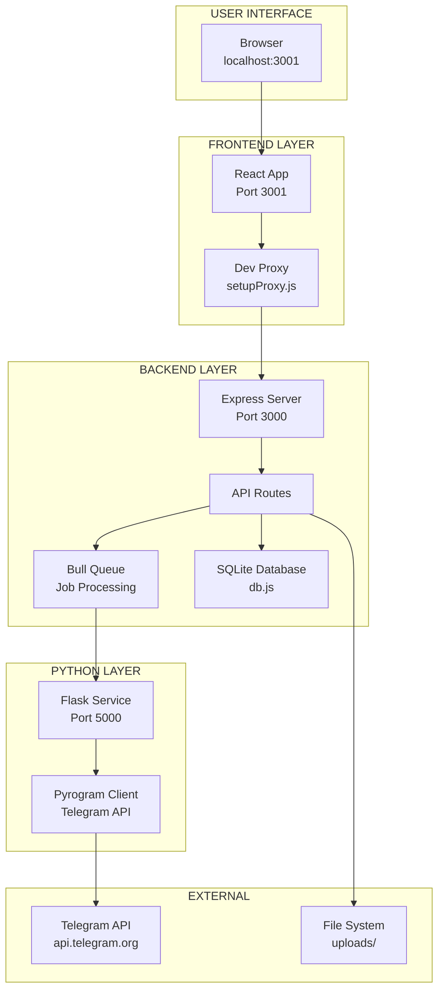

## 2. STARTUP SEQUENCE DETAIL

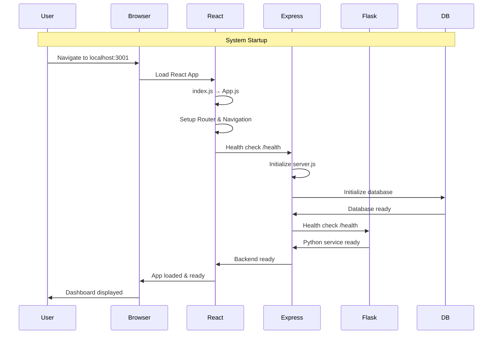

## 3. NAVIGASI ANTAR HALAMAN

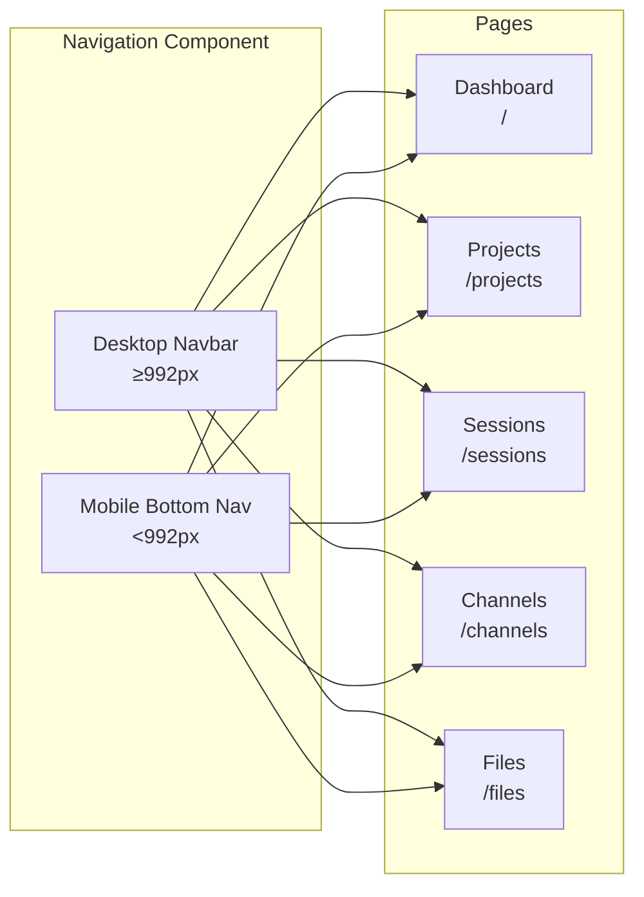

## 4. ALUR DATA DASHBOARD

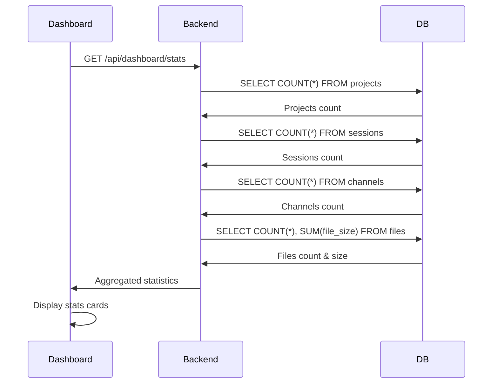

## 5. ALUR MANAJEMEN PROJECTS

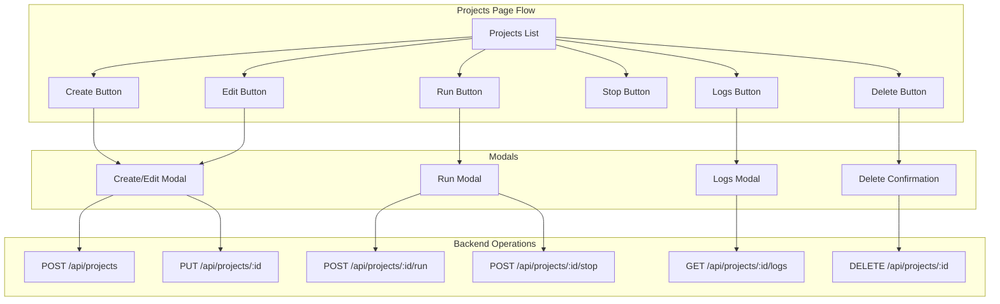

## 6. ALUR MANAJEMEN SESSIONS

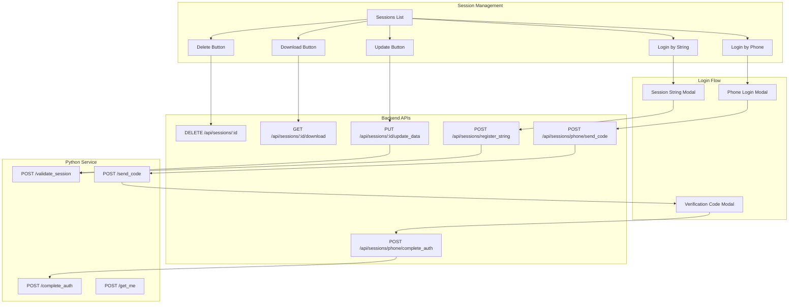

## 7. ALUR JOB QUEUE SYSTEM

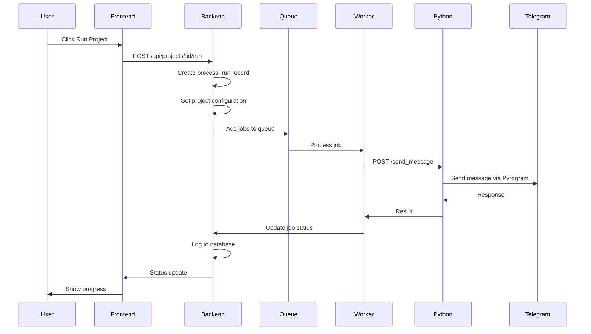

## 8. STRUKTUR DATABASE

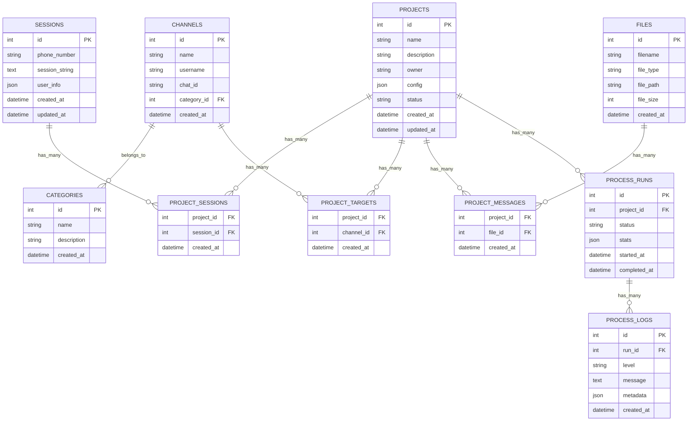

## 9. API ENDPOINTS MAPPING

```mermaid
graph LR
    subgraph "Frontend Components"
        DashboardComp[Dashboard.js]
        ProjectsComp[Projects.js]
        SessionsComp[Sessions.js]
        ChannelsComp[Channels.js]
        FilesComp[Files.js]
    end
    
    subgraph "Backend Routes"
        DashboardRoute[/api/dashboard/*]
        ProjectsRoute[/api/projects/*]
        SessionsRoute[/api/sessions/*]
        ChannelsRoute[/api/channels/*]
        FilesRoute[/api/files/*]
        InternalRoute[/internal/*]
    end
    
    subgraph "Python Endpoints"
        SendCode[/send_code]
        CompleteAuth[/complete_auth]
        ValidateSession[/validate_session]
        SendMessage[/send_message]
        GetMe[/get_me]
    end
    
    DashboardComp --> DashboardRoute
    ProjectsComp --> ProjectsRoute
    SessionsComp --> SessionsRoute
    ChannelsComp --> ChannelsRoute
    FilesComp --> FilesRoute
    
    SessionsRoute --> InternalRoute
    ProjectsRoute --> InternalRoute
    
    InternalRoute --> SendCode
    InternalRoute --> CompleteAuth
    InternalRoute --> ValidateSession
    InternalRoute --> SendMessage
    InternalRoute --> GetMe
```

## 10. RESPONSIVE DESIGN FLOW

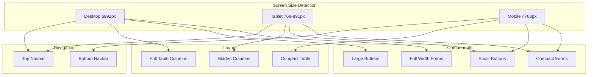

## 11. ERROR HANDLING FLOW

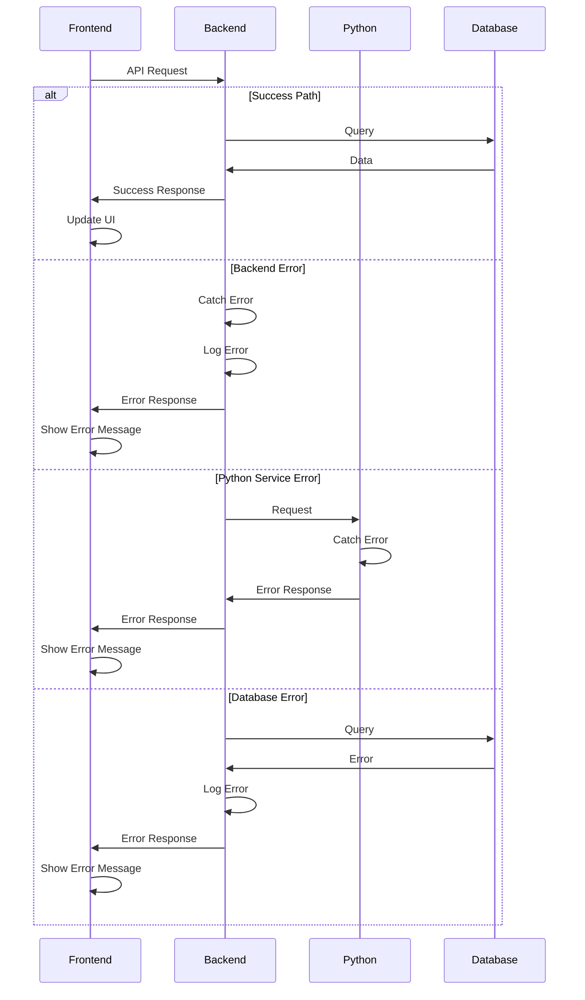

## 12. FILE UPLOAD FLOW

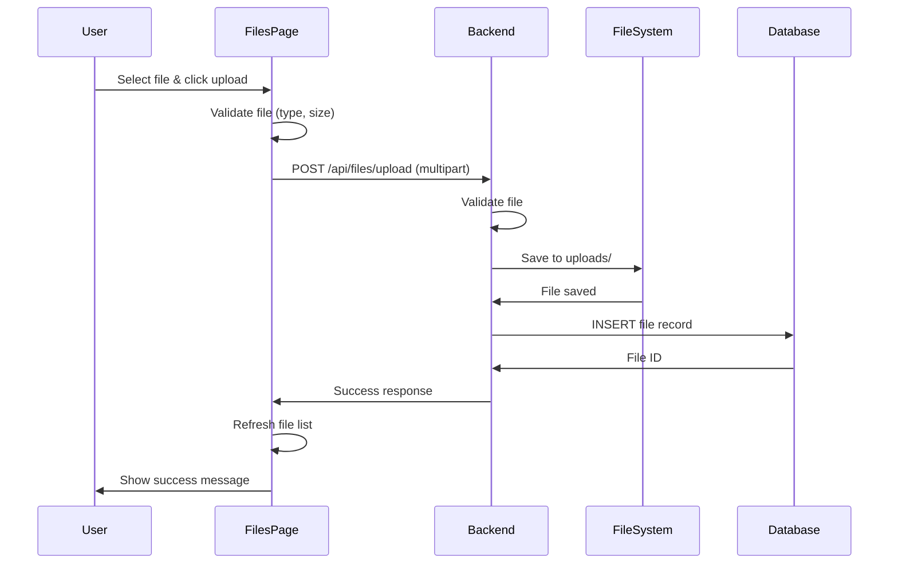

Diagram-diagram ini memberikan visualisasi lengkap tentang bagaimana setiap bagian sistem terhubung dan berinteraksi satu sama lain.
